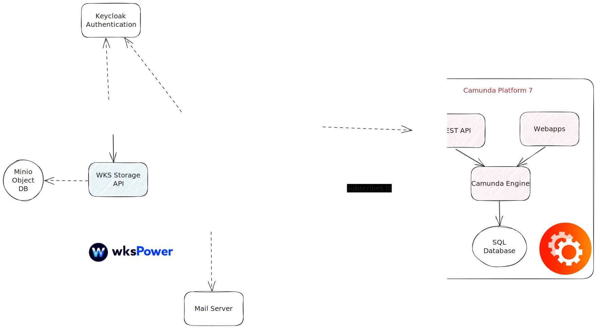

# Platform Architecture
WKS is built on a modular microservices architecture, designed for scalability, flexibility, and high-performance process automation. The platform integrates open-source technologies with custom services to orchestrate business workflows, manage data, and deliver a responsive user experience.

## The architecture is composed of the following core components::

1.	**Camunda**: An open-source Business Process Management (BPM) engine used to define, orchestrate, and execute complex workflows. Camunda ensures transactional integrity and acts as the central orchestrator for distributed services, following the Saga Pattern for managing long-running business processes.
2.	**Case Engine - Rest API**: A custom API layer that exposes functionality for case management. It enables creation, modification, and retrieval of case data, and serves as a key integration point for other services in the platform.
3.	**Case Engine - Camunda External Tasks**: This service interacts directly with Camunda to process external tasks asynchronously. It enables the execution of business logic within workflows without tightly coupling it to the BPM engine.
4.	**E-mail to Case**: A utility service that transforms emails into structured cases. It automates case creation from email communication, streamlining service desk, support, and request workflows.
5.	**Storage API**: An API service used to store and retrieve files in the object storage layer (MinIO). It abstracts the complexity of file management and provides secure access to stored content across services.
6.	**Case Portal**: The primary user interface of the platform, built with React. It allows users to manage cases, interact with workflows, and perform administrative tasks via an intuitive web application.
7.  **Websocket Publisher**: Responsible for sending real-time backend event updates to the frontend. It keeps the UI synchronized with the state of long-running processes and data changes.
8.  **Novu Publisher**: Integrates with [Novu](https://novu.co/), an open-source notification infrastructure, to manage and deliver multi-channel communications — including Email, SMS, Push, In-App, and Direct messages. This ensures users are notified at every relevant step in a process.
9. **Kafka**: A distributed event streaming platform that serves as the backbone for asynchronous communication across the platform. Kafka decouples producers and consumers, allowing for real-time, scalable, and reliable data flow. It powers both the WebSocket and Novu publishers, ensuring seamless event handling.
10.	**MinIO**: An S3-compatible object storage server used for storing files and attachments securely and efficiently. It offers high durability and is optimized for cloud-native applications.
11.	**MongoDB**: A document-oriented NoSQL database used for persistent data storage. It offers flexibility and scalability for storing structured and semi-structured data used by core services like the Case Engine and Email to Case.
12.	**OPA (Open Policy Agent)**: A policy-based access control engine that governs user permissions and enforces security rules across the platform. OPA enables fine-grained access management based on roles, conditions, and policies.
13.	**Traefik**: A modern reverse proxy and load balancer that manages routing of HTTP/S traffic to internal services. It handles SSL termination, traffic splitting, and service discovery, ensuring secure and resilient access to platform endpoints.
14.	**Keycloak**: An open-source identity and access management (IAM) solution used for authentication and user federation. Keycloak ensures secure user login, token-based authentication, and single sign-on (SSO) support.
15.	**Demo Data Loader**: A service used to preload sample data into the platform. It interacts with MongoDB, Camunda, and Keycloak, making it possible to populate users, processes, and case data for demonstration or testing purposes.

## Architecture Overview

The platform architecture is composed of multiple microservices, each fulfilling specific functions and communicating with each other to provide a cohesive system.

The main architectural components are shown in the diagram below and are elaborated on in the further sections.

### Custom API Services

Several custom API services are developed to provide specific functionalities within the platform:
- **Case Engine - Rest API**: This API service exposes functionality related to the case engine, allowing the creation, modification, and retrieval of cases.
- **Case Engine - Camunda External Tasks**: Camunda External tasks interacts with the BPM engine and performs specific tasks related to business process management.
- **E-mail to case**: This service converts incoming emails into cases within the platform, automating the process of creating cases from email communication.
- **Storage API**: This API service enables interaction with the Minio storage, allowing other services to store and retrieve files and data.
- **Websocket Publisher**: Ensures seamless transmission of backend event notifications to the User Interface (UI), keeping your interface updated in real-time.
- **Novu Publisher**: Seamlessly integrates with [Novu](https://novu.co/), a comprehensive communication management platform. Novu offers intuitive components and APIs, centralizing the management of all communication channels, including Email, SMS, Direct, In-App, and Push notifications, simplifying your communication workflows.
- **Demo data loader** service is responsible for loading demo data into the platform. It interacts with MongoDB, the BPM engine, and Keycloak to populate the necessary data for the platform's operation.

### Business Process Management

Camunda is used as the BPM platform, providing workflow automation and process execution capabilities. It allows the definition and execution of complex business processes, managing process instances, tasks, and user interactions.

### User Interface

The `case-portal` web application serves as the user interface for the platform. It is built with React and provides a user-friendly interface for interacting with cases, processes, and platform functionalities.

### Storage

Minio is employed as the object storage server, providing durable and scalable storage for files and data within the platform. It offers an S3-compatible API and allows services to store and retrieve data from the storage backend.

### Database

MongoDB is the chosen NoSQL database for persistent data storage. It provides high performance, scalability, and flexibility for storing structured and unstructured data. Services within the platform interact with MongoDB for data persistence and retrieval.

### Authorization and Access Control

OPA (Open Policy Agent) is integrated into the platform for policy-based authorization and access control. It enables fine-grained control over access to platform resources based on defined policies.

### Identity and Access Management

Keycloak is utilized as the identity and access management solution. It enables user authentication, authorization, and user management functionalities within the platform. Keycloak ensures secure access to platform resources and APIs.

### Reverse Proxy and Load Balancer

Traefik is utilized as the reverse proxy and load balancer. It provides routing capabilities, SSL termination, and load balancing for the services deployed in the platform. Traefik enables secure access to services through HTTP and HTTPS protocols.

### Kafka Event Hub
Kafka plays a pivotal role as the event hub within the platform, supporting seamless communication between services and ensuring real-time event processing. It serves as the backbone for asynchronous event handling, facilitating reliable and scalable communication between components.

Kafka supports both Websockets and Novu integrations, enabling the Websocket Publisher and Novu Publisher to capture and process backend events efficiently. By centralizing event streams and decoupling producers and consumers, Kafka enhances the platform's flexibility and scalability, enabling efficient communication across distributed systems.

### Communication and Dependencies
The services within the platform communicate with each other through well-defined APIs and network connections, with microservices orchestration meticulously handled by Camunda. Acting as a microservice orchestrator, Camunda ensures transaction correctness and maintains data integrity across service interactions.

Camunda leverages the SAGA (Saga Pattern) to manage distributed transactions effectively. By coordinating the sequence of operations across multiple services, Camunda ensures that complex platform operations are executed reliably and consistently, even in the face of failures.

The Case Enginr Rest API serves as the gateway to the database, facilitating data access for Camunda External Tasks, Email to Case, and Storage API. This streamlined approach enhances efficiency and maintains data integrity throughout the platform.

These services rely on MongoDB, Camunda, and Keycloak for seamless operation, leveraging their functionalities to perform specific tasks efficiently. The architecture is meticulously designed to be scalable and resilient, enabling seamless addition and removal of services as per the platform's evolving requirements.
