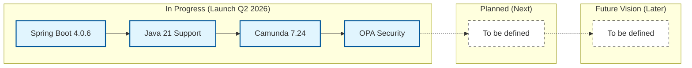

# 🗺️ Roadmap

The WKS Platform roadmap outlines our vision for providing a robust, modern, and secure Business Process Management (BPM) and Case Management solution. Our goal is to empower teams to orchestrate complex workflows with ease and reliability.

> **Note:** This roadmap is a statement of intent and priorities. It is not a rigid schedule, and plans may evolve based on community feedback and market requirements.

## 📊 Visual Roadmap

---

## 🛠️ In Progress (Launch Q2 2026)

This phase focuses on the upcoming major release, modernizing the core infrastructure and security layer.

*   **Core Stack Modernization:** Migration to **Java 21** (LTS) and **Spring Boot 4.0.6**.
*   **Camunda Engine Upgrade:** Official support for **Camunda 7.24.0**.
*   **Native OPA Security:** Deep integration with **Open Policy Agent (OPA)** for granular, fail-closed authorization.
*   **Performance Optimization:** Migration to **Apache HttpClient 5** and optimized network timeouts for OPA authorization.
*   **Multi-architecture CI:** Automated builds for **Linux/amd64** and **Linux/arm64** images.

## 📅 Planned (Next)

*To be defined.*

## 🔭 Future Vision (Later)

*To be defined.*
