# Roadmap

The WKS Platform roadmap outlines our vision for providing a robust, modern, and secure Business Process Management (BPM) and Case Management solution. We follow a versioned release strategy, focusing on stability, security, and developer experience.

## Platform Evolution

```mermaid
flowchart LR
    %% v1.4.14: Previous stable line
    subgraph V14 ["v1.4.14"]
        direction TB
        L1[Java 17 / SB 3]
        L2[Legacy Security State]
    end

    %% v1.5.0: Current release
    subgraph V15 ["v1.5.0 (The Stabilization) — Current"]
        direction TB
        A[Spring Boot 4.0.6]
        B[Java 21 Support]
        C[Camunda 7.24]
        S[Zero Critical Vulns]
    end

    %% Future: TBD
    subgraph V_FUTURE ["Future Vision"]
        direction TB
        F1[To be defined]
    end

    %% Logical Flow
    V14 --> V15
    V15 -.-> V_FUTURE

    %% Styling
    classDef completed fill:#c8e6c9,stroke:#2e7d32,stroke-width:2px;
    classDef current fill:#e1f5fe,stroke:#01579b,stroke-width:2px;
    classDef planned fill:#fff,stroke:#333,stroke-width:1px,stroke-dasharray: 5 5;
    
    class V14 completed;
    class V15 current;
    class V_FUTURE planned;
    class L1,L2,A,B,C,S,F1 text;
```

---

## v1.4.14
**Theme: Maintenance & Support**

The previous stable line, on Java 17 and Spring Boot 3.x. It continues to receive maintenance updates through the v1.5.x migration grace period — see the [Support & Release Policy](./release-policy.md).

---

## v1.5.0 (Current Release)
**Theme: The Stabilization Release**

The current release. A stabilization release that hardens the existing platform: upgrading core dependencies to current LTS/supported versions and clearing High and Critical vulnerabilities, without changing the application's capabilities.

*   **Zero-Vulnerability Baseline**: Elimination of all High and Critical CVEs across the platform.
*   **Java 21 & Spring Boot 4**: Transition to the latest LTS and next-gen framework standards.
*   **Camunda 7.24 Integration**: Optimized workflow engine performance and long-term support.

---

## Planned & Future Vision
**Theme: TBD**

*To be defined.*
