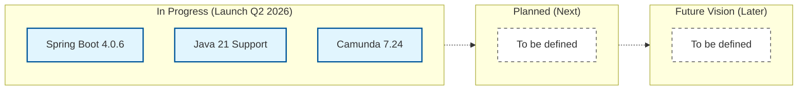

# Roadmap

The WKS Platform roadmap outlines our vision for providing a robust, modern, and secure Business Process Management (BPM) and Case Management solution. This roadmap is a statement of intent and priorities. It is not a rigid schedule, and plans may evolve based on community feedback and market requirements.

## Visual Roadmap

---

## In Progress (Launch Q2 2026)

This phase focuses on the upcoming major release, modernizing the core infrastructure of the platform.

*   **Java Migration:** Full support for **Java 21** (LTS).
*   **Spring Boot Upgrade:** Migration to **Spring Boot 4.0.6**.
*   **Camunda Engine Upgrade:** Official support for **Camunda 7.24**.

## Planned (Next)

*To be defined.*

## Future Vision (Later)

*To be defined.*
