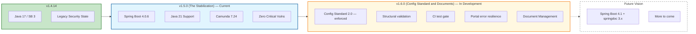

# Roadmap

The WKS Platform roadmap outlines our vision for providing a robust, modern, and secure Business Process Management (BPM) and Case Management solution. We follow a versioned release strategy, focusing on stability, security, and developer experience.

## Platform Evolution

```mermaid
flowchart LR
    %% v1.4.14: Previous stable line
    subgraph V14 ["v1.4.14"]
        direction TB
        L1[Java 17 / SB 3]
        L2[Legacy Security State]
    end

    %% v1.5.0: Current release
    subgraph V15 ["v1.5.0 (The Stabilization) — Current"]
        direction TB
        A[Spring Boot 4.0.6]
        B[Java 21 Support]
        C[Camunda 7.24]
        S[Zero Critical Vulns]
    end

    %% v1.6.0: Next release, in development
    subgraph V16 ["v1.6.0 (Config Standard and Documents) — In Development"]
        direction TB
        G1[Config Standard 2.0 — enforced]
        G2[Structural validation]
        G3[CI test gate]
        G4[Portal error resilience]
        G5[Document Management]
    end

    %% Future: TBD
    subgraph V_FUTURE ["Future Vision"]
        direction TB
        F1[Spring Boot 4.1 + springdoc 3.x]
        F2[More to come]
    end

    %% Logical Flow
    V14 --> V15
    V15 --> V16
    V16 -.-> V_FUTURE

    %% Styling
    classDef completed fill:#c8e6c9,stroke:#2e7d32,stroke-width:2px;
    classDef current fill:#e1f5fe,stroke:#01579b,stroke-width:2px;
    classDef indev fill:#fff8e1,stroke:#f57f17,stroke-width:2px;
    classDef planned fill:#fff,stroke:#333,stroke-width:1px,stroke-dasharray: 5 5;

    class V14 completed;
    class V15 current;
    class V16 indev;
    class V_FUTURE planned;
    class L1,L2,A,B,C,S,G1,G2,G3,G4,G5,F1,F2 text;
```

---

## v1.4.14
**Theme: Maintenance & Support**

The previous stable line, on Java 17 and Spring Boot 3.x. It continues to receive maintenance updates through the v1.5.x migration grace period — see the [Support & Release Policy](./release-policy.md).

---

## v1.5.0 (Current Release)
**Theme: The Stabilization Release**

The current release. A stabilization release that hardens the existing platform: upgrading core dependencies to current LTS/supported versions and clearing High and Critical vulnerabilities, without changing the application's capabilities.

*   **Zero-Vulnerability Baseline**: Elimination of all High and Critical CVEs across the platform.
*   **Java 21 & Spring Boot 4**: Transition to the latest LTS and next-gen framework standards.
*   **Camunda 7.24 Integration**: Optimized workflow engine performance and long-term support.

---

## v1.6.0 (Next — In Development)
**Theme: The Configuration Standard & Document Management**

The next release consolidates the platform's foundations into a governed, versioned, **enforced** configuration contract, and introduces **Document Management** as a first-class, config-driven capability. It builds directly on the v1.5.0 stabilization — same runtime stack (Spring Boot 4.0.6 · Java 21 · Camunda 7.24) — now with stronger guarantees about *what configuration is valid* and *what a case type requires*.

**Pillar 1 — The Configuration Standard & foundations** *(delivered on `develop`)*

*   **A published, versioned Standard**: case-type configuration (Case Definition, Form, Record Type, Queue) is now a documented, versioned set of JSON Schemas — one source of truth shared by the backend, the portal, and tooling.
*   **Enforced on write**: the API validates configuration on create/update and rejects non-conforming documents, turning the Standard from advisory into a real contract.
*   **Structural validation**: checks beyond schema shape — e.g. a stage-transition hook can't target a stage the case type doesn't define.
*   **A real CI safety net**: pull requests are gated on unit + integration tests (previously silently skipped) with coverage reporting, so regressions are caught before merge.
*   **A resilient portal**: failed API calls surface as clear errors instead of vanishing; a bad payload degrades gracefully instead of white-screening.
*   **Dependency governance**: grouped, reviewed dependency updates that keep framework upgrades deliberate.

**Pillar 2 — Document Management** *(in progress)*

*   **Config-declared document requirements**: case types declare the documents they require, and each case surfaces a completeness checklist.
*   **Storage modes & durable references**, **document lifecycle** (verify / reject with server-stamped actors), and **versioning** (re-upload supersedes the prior version) — landing as a stacked series of slices, the first of which is in review.

**Breaking changes**

*   **`kanbanConfig` removed** from the Case Definition contract (Configuration Standard → **2.0**). Kanban board columns now derive from a case type's `stages`; per-card presentation moves to a separate, versioned board-config artifact — see the [`@wkspower/case-config-schema` changelog](https://github.com/wkspower/wks-platform/blob/develop/packages/case-config-schema/CHANGELOG.md). The removed field was deprecated and empty across all shipped case types.

---

## Planned & Future Vision
**Theme: Deliberate Modernization & Depth**

*   **Complete the Document Management arc** — remaining slices (search / preview, retention, versioning polish) beyond the first Document Management release.
*   **Spring Boot 4.1 + springdoc-openapi 3.x** — a deliberate, verified framework-minor upgrade. springdoc 2.x is incompatible with Spring Boot 4 (the Swagger UI is affected), so the two move together as one reviewed change rather than an unvetted auto-bump.
*   **Persisted board-config store** — the board-config schema is published (Standard 2.0); a backing store/endpoint follows when there's a concrete need for per-card presentation.
*   **Repository-backed configuration checks** — extend structural validation to cross-document integrity (e.g. a Case Definition's `formKey` must reference an existing Form) at the domain command layer.
