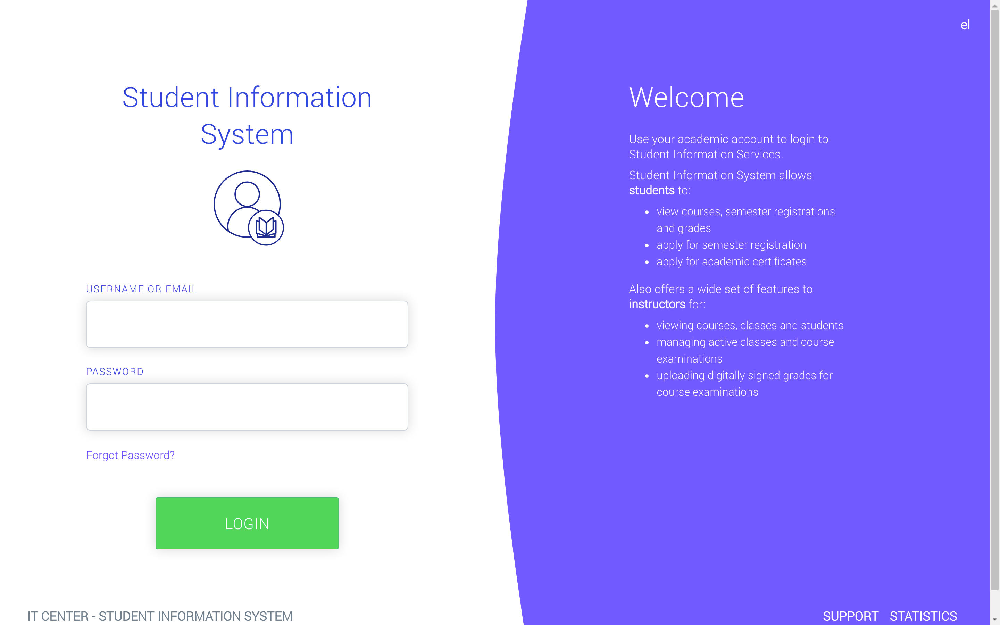
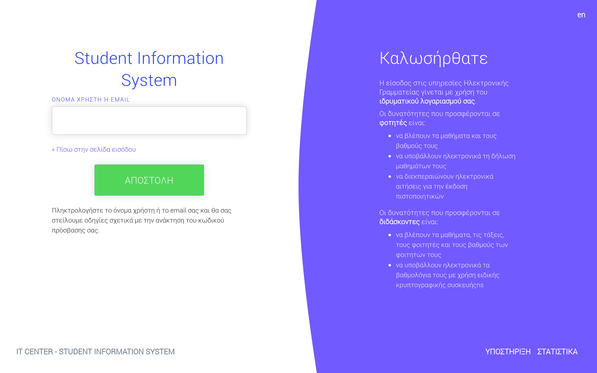
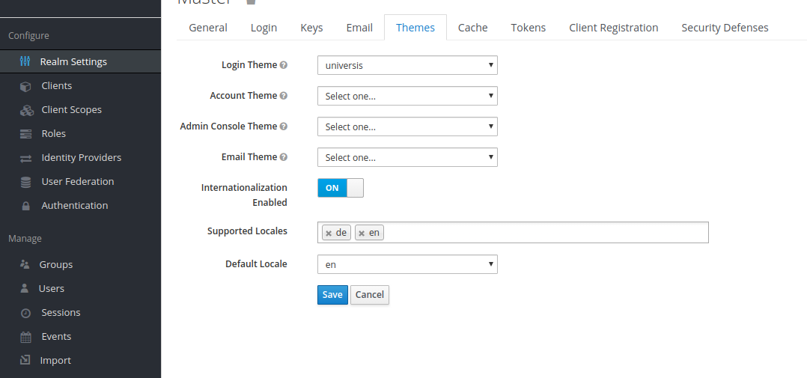
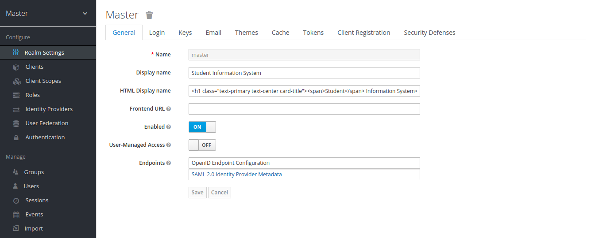

### Universis Keycloak theme

A theme for keycloak login pages which follows Universis project theme.

#### Installation

1. Clone this repository to `themes/` directory of your keycloak installation

    git clone https://gitlab.com/universis/universis-keycloak-theme.git

2. Open admin console and go to your realm settings. Change login theme with universis-keycloak-theme.

**Important Note**: The current version of universis-keycloak-theme integrates only login page theme. Do not use it for account or admin theme.

Note: You may also want to enable localization. Set `Internationalization Enabled` to on and set your default locale.

3. Go to realm general settings and change `Display name` and `HTML Display name` properties.

`Display name` = `Student Information System`

`HTML Display name` = `<h1 class="text-primary text-center card-title">Student Information System</h1>`

#### Development

Start keycloak standalone server and don't forget to disable theme caching.

./standalone/configuration/standalone.xml

    ...
    <theme>
      <staticMaxAge>-1</staticMaxAge>
      <cacheThemes>false</cacheThemes>
      <cacheTemplates>false</cacheTemplates>
      <dir>${jboss.home.dir}/themes</dir>
    </theme>
    ...
